# Beads - Dependency-Aware Issue Tracker

**Tagline**: "Issues chained together like beads"

## Vision

A lightweight, standalone issue tracker that makes dependency graphs first-class citizens. The killer feature: automatic detection of "ready work" - issues with no open blockers.

**Philosophy**:
- SQLite by default (zero setup, single binary + database file)
- PostgreSQL for teams/scale (multi-user, better performance)
- CLI-first, with clean output for both humans and scripts
- Dependencies are the core primitive, not an afterthought
- Full audit trail of all changes

---

## Architecture Diagrams

### System Architecture


**Current Status:** Only SQLite is implemented. PostgreSQL support is designed and planned for Phase 3 (see Implementation Roadmap below).

### Entity Relationship Diagram


### Dependency Flow & Ready Work Calculation


### CLI Command Structure


### Data Flow: Creating an Issue with Dependencies


### Collaborative Workflow: Humans + AI Agents + Git

```mermaid
graph TB
    subgraph "Human Developer"
        Human[👤 Human<br/>Developer]
    end

    subgraph "AI Worker Agents"
        Agent1[🤖 Agent 1<br/>Feature Dev]
        Agent2[🤖 Agent 2<br/>Bug Fixing]
        Agent3[🤖 Agent 3<br/>Testing]
    end

    subgraph "Shared Project Repository"
        Git[(🗂️ Git Repository)]
        BeadsDB[(.beads/issues.jsonl)]
        Code[(Source Code)]
    end

    subgraph "Local Workspaces"
        HumanDB[(SQLite DB)]
        Agent1DB[(SQLite DB)]
        Agent2DB[(SQLite DB)]
    end

    Human -->|bd ready| HumanDB
    Human -->|bd create/update| HumanDB
    Human -->|bd export| BeadsDB
    Human -->|git commit/push| Git

    Agent1 -->|bd ready --json| Agent1DB
    Agent1 -->|bd update status| Agent1DB
    Agent1 -->|discovers bugs| Agent1DB
    Agent1 -->|bd export| BeadsDB

    Agent2 -->|bd ready --json| Agent2DB
    Agent2 -->|bd close issue| Agent2DB
    Agent2 -->|bd export| BeadsDB

    Agent3 -->|bd create test task| Agent3DB
    Agent3 -->|bd dep add| Agent3DB
    Agent3 -->|bd export| BeadsDB

    Git -->|git pull| Human
    Git -->|git pull| Agent1
    Git -->|git pull| Agent2

    BeadsDB -->|bd import| HumanDB
    BeadsDB -->|bd import| Agent1DB
    BeadsDB -->|bd import| Agent2DB

    Agent1 -->|git push| Git
    Agent2 -->|git push| Git
    Agent3 -->|git push| Git

    Code -.lives alongside.-> BeadsDB

    style Human fill:#64b5f6,color:#fff
    style Agent1 fill:#81c784,color:#fff
    style Agent2 fill:#81c784,color:#fff
    style Agent3 fill:#81c784,color:#fff
    style Git fill:#f06292,color:#fff
    style BeadsDB fill:#ffd54f,color:#000
    style HumanDB fill:#e0e0e0
    style Agent1DB fill:#e0e0e0
    style Agent2DB fill:#e0e0e0
```



**Workflow Steps:**

1. **Pull** - Everyone pulls latest code + `.beads/issues.jsonl` from git
2. **Import** - Run `bd import -i .beads/issues.jsonl` to sync local SQLite cache
3. **Query** - Run `bd ready` to find unblocked work
4. **Work** - Update issues as work progresses (`bd update`, `bd create`, `bd close`)
5. **Discover** - Agents create new issues when they find bugs/TODOs
6. **Export** - Run `bd export -o .beads/issues.jsonl` before committing
7. **Push** - Commit both code changes and `.beads/issues.jsonl` together
8. **Merge** - On conflicts, use `bd import --resolve-collisions` to auto-resolve

**Benefits:**
- Single source of truth (`.beads/issues.jsonl` in git)
- Fast local queries (SQLite cache)
- Offline work supported
- Automatic collision resolution on merge
- Full audit trail preserved

---

## Core Data Model

### Issues

```go
type Issue struct {
    ID                 string    // "bd-1", "bd-2" (beads- prefix)
    Title              string    // max 500 chars
    Description        string    // problem statement (what/why)
    Design             string    // solution design (how)
    AcceptanceCriteria string    // definition of done
    Notes              string    // working notes
    Status             Status    // open, in_progress, blocked, closed
    Priority           int       // 0 (highest) to 4 (lowest), default 2
    IssueType          IssueType // bug, feature, task, epic, chore
    Assignee           string    // optional
    EstimatedMinutes   *int      // optional
    CreatedAt          time.Time
    UpdatedAt          time.Time
    ClosedAt           *time.Time
}

type Status string
const (
    StatusOpen       Status = "open"
    StatusInProgress Status = "in_progress"
    StatusBlocked    Status = "blocked"
    StatusClosed     Status = "closed"
)

type IssueType string
const (
    TypeBug     IssueType = "bug"
    TypeFeature IssueType = "feature"
    TypeTask    IssueType = "task"
    TypeEpic    IssueType = "epic"
    TypeChore   IssueType = "chore"
)
```

### Dependencies

```go
type Dependency struct {
    IssueID      string         // the issue that depends
    DependsOnID  string         // the issue it depends on
    Type         DependencyType // relationship type
    CreatedAt    time.Time
    CreatedBy    string
}

type DependencyType string
const (
    DepBlocks      DependencyType = "blocks"      // hard blocker
    DepRelated     DependencyType = "related"     // soft relationship
    DepParentChild DependencyType = "parent-child" // epic/subtask
)
```

### Labels

```go
type Label struct {
    IssueID string
    Label   string // freeform tag
}
```

### Events (Audit Trail)

```go
type Event struct {
    ID         int64
    IssueID    string
    EventType  EventType
    Actor      string    // who made the change
    OldValue   *string   // before state (JSON)
    NewValue   *string   // after state (JSON)
    Comment    *string   // for comment events
    CreatedAt  time.Time
}

type EventType string
const (
    EventCreated          EventType = "created"
    EventUpdated          EventType = "updated"
    EventStatusChanged    EventType = "status_changed"
    EventCommented        EventType = "commented"
    EventClosed           EventType = "closed"
    EventReopened         EventType = "reopened"
    EventDependencyAdded  EventType = "dependency_added"
    EventDependencyRemoved EventType = "dependency_removed"
    EventLabelAdded       EventType = "label_added"
    EventLabelRemoved     EventType = "label_removed"
)
```

---

## Backend Abstraction

### Storage Interface

```go
// Storage defines the interface for issue storage backends
type Storage interface {
    // Issues
    CreateIssue(ctx context.Context, issue *Issue, actor string) error
    GetIssue(ctx context.Context, id string) (*Issue, error)
    UpdateIssue(ctx context.Context, id string, updates map[string]interface{}, actor string) error
    CloseIssue(ctx context.Context, id string, reason string, actor string) error
    SearchIssues(ctx context.Context, query string, filter IssueFilter) ([]*Issue, error)

    // Dependencies
    AddDependency(ctx context.Context, dep *Dependency, actor string) error
    RemoveDependency(ctx context.Context, issueID, dependsOnID string, actor string) error
    GetDependencies(ctx context.Context, issueID string) ([]*Issue, error)
    GetDependents(ctx context.Context, issueID string) ([]*Issue, error)
    GetDependencyTree(ctx context.Context, issueID string, maxDepth int) ([]*TreeNode, error)
    DetectCycles(ctx context.Context) ([][]*Issue, error)

    // Labels
    AddLabel(ctx context.Context, issueID, label, actor string) error
    RemoveLabel(ctx context.Context, issueID, label, actor string) error
    GetLabels(ctx context.Context, issueID string) ([]string, error)
    GetIssuesByLabel(ctx context.Context, label string) ([]*Issue, error)

    // Ready Work & Blocking
    GetReadyWork(ctx context.Context, filter WorkFilter) ([]*Issue, error)
    GetBlockedIssues(ctx context.Context) ([]*BlockedIssue, error)

    // Events
    AddComment(ctx context.Context, issueID, actor, comment string) error
    GetEvents(ctx context.Context, issueID string, limit int) ([]*Event, error)

    // Statistics
    GetStatistics(ctx context.Context) (*Statistics, error)

    // Lifecycle
    Close() error
}

type IssueFilter struct {
    Status   *Status
    Priority *int
    IssueType *IssueType
    Assignee *string
    Labels   []string
    Limit    int
}

type WorkFilter struct {
    Status   Status // default: open
    Priority *int   // filter by priority
    Assignee *string
    Limit    int    // default: 10
}

type BlockedIssue struct {
    Issue
    BlockedByCount int
    BlockedBy      []string // issue IDs
}

type TreeNode struct {
    Issue
    Depth     int
    Truncated bool // if hit max depth
}

type Statistics struct {
    TotalIssues      int
    OpenIssues       int
    InProgressIssues int
    ClosedIssues     int
    BlockedIssues    int
    ReadyIssues      int
    AverageLeadTime  float64 // hours from open to closed
}
```

### Backend Implementations

```
storage/
  storage.go          // Interface definition
  sqlite/
    sqlite.go         // SQLite implementation
    migrations.go     // Schema migrations
  postgres/
    postgres.go       // PostgreSQL implementation
    migrations.go     // Schema migrations
  factory.go          // Backend factory
```

### Factory Pattern

```go
type Config struct {
    Backend  string // "sqlite" or "postgres"

    // SQLite config
    Path     string // default: ~/.beads/beads.db

    // PostgreSQL config
    Host     string
    Port     int
    Database string
    User     string
    Password string
    SSLMode  string
}

func NewStorage(config Config) (Storage, error) {
    switch config.Backend {
    case "sqlite":
        return sqlite.New(config.Path)
    case "postgres":
        return postgres.New(config.Host, config.Port, config.Database,
                           config.User, config.Password, config.SSLMode)
    default:
        return nil, fmt.Errorf("unknown backend: %s", config.Backend)
    }
}
```

---

## Schema Design

### SQLite Schema

```sql
-- Issues table
CREATE TABLE issues (
    id TEXT PRIMARY KEY,
    title TEXT NOT NULL CHECK(length(title) <= 500),
    description TEXT NOT NULL DEFAULT '',
    design TEXT NOT NULL DEFAULT '',
    acceptance_criteria TEXT NOT NULL DEFAULT '',
    notes TEXT NOT NULL DEFAULT '',
    status TEXT NOT NULL DEFAULT 'open',
    priority INTEGER NOT NULL DEFAULT 2 CHECK(priority >= 0 AND priority <= 4),
    issue_type TEXT NOT NULL DEFAULT 'task',
    assignee TEXT,
    estimated_minutes INTEGER,
    created_at DATETIME NOT NULL DEFAULT CURRENT_TIMESTAMP,
    updated_at DATETIME NOT NULL DEFAULT CURRENT_TIMESTAMP,
    closed_at DATETIME
);

CREATE INDEX idx_issues_status ON issues(status);
CREATE INDEX idx_issues_priority ON issues(priority);
CREATE INDEX idx_issues_assignee ON issues(assignee);
CREATE INDEX idx_issues_created_at ON issues(created_at);

-- Dependencies table
CREATE TABLE dependencies (
    issue_id TEXT NOT NULL,
    depends_on_id TEXT NOT NULL,
    type TEXT NOT NULL DEFAULT 'blocks',
    created_at DATETIME NOT NULL DEFAULT CURRENT_TIMESTAMP,
    created_by TEXT NOT NULL,
    PRIMARY KEY (issue_id, depends_on_id),
    FOREIGN KEY (issue_id) REFERENCES issues(id) ON DELETE CASCADE,
    FOREIGN KEY (depends_on_id) REFERENCES issues(id) ON DELETE CASCADE
);

CREATE INDEX idx_dependencies_issue ON dependencies(issue_id);
CREATE INDEX idx_dependencies_depends_on ON dependencies(depends_on_id);

-- Labels table (many-to-many)
CREATE TABLE labels (
    issue_id TEXT NOT NULL,
    label TEXT NOT NULL,
    PRIMARY KEY (issue_id, label),
    FOREIGN KEY (issue_id) REFERENCES issues(id) ON DELETE CASCADE
);

CREATE INDEX idx_labels_label ON labels(label);

-- Events table (audit trail)
CREATE TABLE events (
    id INTEGER PRIMARY KEY AUTOINCREMENT,
    issue_id TEXT NOT NULL,
    event_type TEXT NOT NULL,
    actor TEXT NOT NULL,
    old_value TEXT,
    new_value TEXT,
    comment TEXT,
    created_at DATETIME NOT NULL DEFAULT CURRENT_TIMESTAMP,
    FOREIGN KEY (issue_id) REFERENCES issues(id) ON DELETE CASCADE
);

CREATE INDEX idx_events_issue ON events(issue_id);
CREATE INDEX idx_events_created_at ON events(created_at);

-- Ready work view (materialized via trigger)
-- Issues with no open dependencies
CREATE VIEW ready_issues AS
SELECT i.*
FROM issues i
WHERE i.status = 'open'
  AND NOT EXISTS (
    SELECT 1 FROM dependencies d
    JOIN issues blocked ON d.depends_on_id = blocked.id
    WHERE d.issue_id = i.id
      AND d.type = 'blocks'
      AND blocked.status IN ('open', 'in_progress', 'blocked')
  );

-- Blocked issues view
CREATE VIEW blocked_issues AS
SELECT
    i.*,
    COUNT(d.depends_on_id) as blocked_by_count
FROM issues i
JOIN dependencies d ON i.id = d.issue_id
JOIN issues blocker ON d.depends_on_id = blocker.id
WHERE i.status IN ('open', 'in_progress', 'blocked')
  AND d.type = 'blocks'
  AND blocker.status IN ('open', 'in_progress', 'blocked')
GROUP BY i.id;
```

### PostgreSQL Schema Extensions

PostgreSQL can leverage more advanced features:

```sql
-- Use JSONB for flexible metadata
ALTER TABLE issues ADD COLUMN metadata JSONB;
CREATE INDEX idx_issues_metadata ON issues USING GIN(metadata);

-- Use array type for labels (alternative to junction table)
-- (Keep junction table for compatibility, but could optimize)

-- Use recursive CTEs for dependency trees (more efficient)
-- Implement as stored function:
CREATE OR REPLACE FUNCTION get_dependency_tree(root_issue_id TEXT, max_depth INT DEFAULT 50)
RETURNS TABLE (
    issue_id TEXT,
    title TEXT,
    status TEXT,
    priority INT,
    depth INT,
    path TEXT[]
) AS $$
    WITH RECURSIVE tree AS (
        SELECT
            i.id as issue_id,
            i.title,
            i.status,
            i.priority,
            0 as depth,
            ARRAY[i.id] as path
        FROM issues i
        WHERE i.id = root_issue_id

        UNION ALL

        SELECT
            i.id,
            i.title,
            i.status,
            i.priority,
            t.depth + 1,
            t.path || i.id
        FROM issues i
        JOIN dependencies d ON i.id = d.depends_on_id
        JOIN tree t ON d.issue_id = t.issue_id
        WHERE t.depth < max_depth
          AND NOT (i.id = ANY(t.path)) -- cycle detection
    )
    SELECT * FROM tree ORDER BY depth, priority;
$$ LANGUAGE SQL;

-- Cycle detection using CTEs
CREATE OR REPLACE FUNCTION detect_dependency_cycles()
RETURNS TABLE (cycle_path TEXT[]) AS $$
    WITH RECURSIVE paths AS (
        SELECT
            issue_id,
            depends_on_id,
            ARRAY[issue_id, depends_on_id] as path,
            false as is_cycle
        FROM dependencies

        UNION ALL

        SELECT
            p.issue_id,
            d.depends_on_id,
            p.path || d.depends_on_id,
            d.depends_on_id = ANY(p.path)
        FROM paths p
        JOIN dependencies d ON p.depends_on_id = d.issue_id
        WHERE NOT p.is_cycle
          AND array_length(p.path, 1) < 100
    )
    SELECT DISTINCT path
    FROM paths
    WHERE is_cycle
    ORDER BY path;
$$ LANGUAGE SQL;
```

---

## CLI Design

### Command Structure

```
beads [global options] <command> [command options]

Global Options:
  --db <path>          Database path (default: ~/.beads/beads.db)
  --backend <type>     Backend type: sqlite, postgres (default: sqlite)
  --config <path>      Config file path (default: ~/.beads/config.yaml)
  --format <format>    Output format: text, json, yaml (default: text)
  --no-color           Disable colored output

Commands:
  init                 Initialize a new beads database
  create               Create a new issue
  update               Update an issue
  show                 Show issue details
  list                 List issues
  search               Search issues by text
  close                Close one or more issues
  reopen               Reopen a closed issue

  comment              Add a comment to an issue

  dep add              Add a dependency
  dep remove           Remove a dependency
  dep tree             Show dependency tree
  dep cycles           Detect dependency cycles

  label add            Add a label
  label remove         Remove a label
  label list           List all labels
  label issues         List issues with label

  ready                Show ready work (no blockers)
  blocked              Show blocked issues
  stats                Show statistics

  config               Manage configuration
  export               Export database to JSON/YAML
  import               Import from JSON/YAML
  migrate              Migrate from other issue trackers

  help                 Show help
  version              Show version
```

### Example Commands

```bash
# Initialize
beads init                           # Creates ~/.beads/beads.db
beads init --db ./project.db         # Project-local database
beads init --backend postgres        # Interactive setup for PostgreSQL

# Create
beads create "Fix login bug" \
  --description "Users can't log in with Google OAuth" \
  --priority 1 \
  --type bug \
  --label "auth,critical"

# Update
beads update bd-1 --status in_progress --assignee "alice"

# Show
beads show bd-1                      # Full details with dependencies
beads show bd-1 --format json        # JSON output

# List
beads list                           # All open issues
beads list --status closed           # Closed issues
beads list --priority 1              # P1 issues
beads list --label "auth"            # Issues with label

# Dependencies
beads dep add bd-2 bd-1              # bd-2 depends on bd-1
beads dep tree bd-2                  # Show full tree
beads dep cycles                     # Check for cycles

# Ready work
beads ready                          # Top 10 ready issues
beads ready --limit 20 --assignee alice

# Comments
beads comment bd-1 "Started investigation"
beads comment bd-1 --file notes.md  # From file

# Close
beads close bd-1 "Fixed in commit abc123"
beads close bd-1 bd-2 bd-3 --reason "Duplicate"

# Search
beads search "oauth"                 # Full-text search
beads search "oauth" --status open   # With filters

# Stats
beads stats                          # Overall statistics
beads stats --format json            # Machine-readable

# Export/Import
beads export --output backup.json
beads import --input backup.json
beads migrate --from github --repo owner/repo
```

---

## Configuration

### Config File (~/.beads/config.yaml)

```yaml
# Default backend
backend: sqlite

# SQLite config
sqlite:
  path: ~/.beads/beads.db

# PostgreSQL config
postgres:
  host: localhost
  port: 5432
  database: beads
  user: beads
  password: ""
  sslmode: prefer

# Display preferences
display:
  color: true
  format: text  # text, json, yaml
  date_format: "2006-01-02 15:04"

# Issue defaults
defaults:
  priority: 2
  type: task
  status: open

# ID prefix (default: "bd-")
id_prefix: "bd-"

# Actor name (for audit trail)
actor: $USER
```

---

## Implementation Roadmap

### Phase 1: Core Foundation
- [ ] Project setup (go.mod, directory structure)
- [ ] Data model (types, interfaces)
- [ ] SQLite storage implementation
- [ ] Basic CLI (create, list, show, update, close)
- [ ] Dependency management (add, remove, tree)
- [ ] Ready work detection
- [ ] Tests

### Phase 2: Polish & Features
- [ ] Labels support
- [ ] Comments and events
- [ ] Full-text search
- [ ] Cycle detection
- [ ] Statistics
- [ ] Colored CLI output
- [ ] JSON/YAML output formats

### Phase 3: PostgreSQL
- [ ] PostgreSQL storage implementation
- [ ] Config file support
- [ ] Backend switching
- [ ] Migration utilities
- [ ] Performance optimization

### Phase 4: Advanced
- [ ] Export/import
- [ ] GitHub/GitLab/Jira migration tools
- [ ] TUI (bubble tea?)
- [ ] Web UI (templ?)
- [ ] API server mode
- [ ] Multi-user workflows

---

## Key Design Decisions

### Why SQLite Default?

1. **Zero setup**: Single binary + database file
2. **Portability**: Database is a file, easy to backup/share
3. **Performance**: More than enough for <100k issues
4. **Simplicity**: No server to run
5. **Git-friendly**: Can commit database file for small teams

### Why Support PostgreSQL?

1. **Scale**: Better for large teams (>10 people)
2. **Concurrency**: Better multi-user support
3. **Features**: Recursive CTEs, JSONB, full-text search
4. **Existing infrastructure**: Teams already running PostgreSQL

### ID Prefix: "bd-" vs "beads-"

- **bd-**: Shorter, easier to type
- **beads-**: More explicit
- **Configurable**: Let users choose in config

I lean toward **bd-** for brevity.

### Dependency Types

- **blocks**: Hard blocker (affects ready work calculation)
- **related**: Soft relationship (just for context)
- **parent-child**: Epic/subtask hierarchy

Only "blocks" affects ready work detection.

### Status vs. Blocked Field

Should we have a separate `blocked` status, or compute it dynamically?

**Decision**: Compute dynamically
- `blocked` status is redundant with dependency graph
- Auto-blocking based on dependencies is error-prone
- Let users manually set `blocked` if they want (e.g., blocked on external dependency)
- `ready` command shows what's actually unblocked

### Event Storage

Full audit trail in `events` table. This enables:
- Change history for issues
- Comment threads
- "Who changed what when" debugging
- Potential undo/revert functionality

---

## What to Port from VibeCoder

### ✅ Keep
- Core data model (issues, dependencies, labels, events)
- Ready work detection algorithm
- Dependency tree traversal
- Cycle detection
- CLI structure (create, update, show, list, etc.)
- Priority system (1-5)
- Issue types (bug, feature, task, epic, chore)

### ❌ Leave Behind
- MCP server (can add later as separate project)
- VibeCoder-specific concepts (missions, campaigns, amps)
- Temporal workflows
- Web portal integration
- Mission tracking
- Campaign aggregation views

### 🤔 Maybe Later
- Web UI (keep CLI-first)
- API server mode
- TUI with bubble tea
- GitHub/GitLab sync
- Email notifications
- Webhooks

---

## Go Dependencies

Minimal dependencies:

```go
// Core
database/sql
modernc.org/sqlite          // SQLite driver (pure Go, no CGO)

// CLI
github.com/spf13/cobra       // CLI framework
github.com/spf13/viper       // Config management
github.com/fatih/color       // Terminal colors

// Serialization
gopkg.in/yaml.v3             // YAML support

// Testing
github.com/stretchr/testify  // Test assertions
```

No frameworks, no ORMs. Keep it simple.

---

## Open Questions

1. **Multi-database support**: Should one beads installation manage multiple databases?
   - Probably yes: `beads --db project1.db` vs `beads --db project2.db`

2. **Git integration**: Should beads auto-commit the database?
   - Probably no: Let users manage their own git workflow
   - But provide hooks/examples

3. **Web UI**: Build one, or keep it CLI-only?
   - Start CLI-only
   - Web UI as separate project later (beads-web?)

4. **API server**: Should beads run as a server?
   - Start as CLI tool
   - Add `beads serve` command later for HTTP API

5. **Migrations**: How to handle schema changes?
   - Embed migrations in binary
   - Track schema version in database
   - Auto-migrate on startup (with backup)

6. **Concurrency**: SQLite WAL mode for better concurrency?
   - Yes, enable by default
   - Document limitations (single writer at a time)

7. **Full-text search**: SQLite FTS5 or simple LIKE queries?
   - Start with LIKE queries (simpler)
   - Add FTS5 in phase 2

8. **Transactions**: Where do we need them?
   - Issue creation (issue + labels + event)
   - Dependency changes (dep + event + cycle check)
   - Bulk operations (close multiple issues)

---

## Success Metrics

Beads is successful if:

1. **Installation**: `go install github.com/user/beads@latest` just works
2. **First use**: `beads init && beads create "test"` works in <10 seconds
3. **Performance**: Can handle 10k issues with instant CLI responses
4. **Portability**: Database file can be moved between machines, checked into git
5. **Adoption**: Used by at least 3 other developers/teams within 6 months

---

## Next Steps

1. Create `~/src/beads` directory structure
2. Initialize Go module
3. Implement core types (Issue, Dependency, Storage interface)
4. Build SQLite storage implementation
5. Build basic CLI (create, show, list)
6. Test with VibeCoder's issue data (export and import)
7. Iterate toward parity with scripts/issue.ts
8. Release v0.1.0

Let's build something beautiful. 🔗✨
