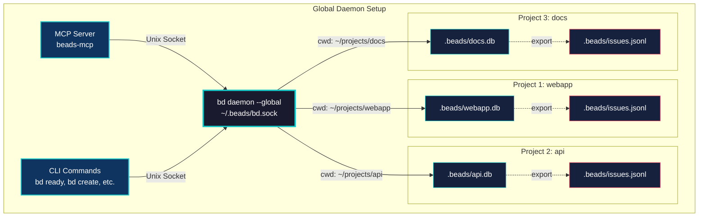

# bd - Beads Issue Tracker 🔗

**Give your coding agent a memory upgrade**

> **🚨 CRITICAL WARNING - Do Not Use for Multiple Workstreams**
>
> **v0.9.x has data duplication and data loss bugs when handling multiple workstreams.** This creates a mess that's difficult even for agents to clean up. Until further notice, **use only for single-workstream projects**. A fix is in progress.

> **🚨 MCP SERVER WARNING - Single Project Only**
>
> **Do NOT use the MCP server if you have multiple beads repositories/projects.** The MCP server currently routes issues to the wrong database when working across multiple repos. **The beads binary (bd command, v0.9.9+) works fine for multi-workstream scenarios** - instruct your agents to use the binary directly via shell commands instead of the MCP server. A fix for the MCP server is in progress.

> **⚠️ Alpha Status**: This project is in active development. The core features work well, but expect API changes before 1.0. Use for development/internal projects first.

Beads is a lightweight memory system for coding agents, using a graph-based issue tracker. Four kinds of dependencies work to chain your issues together like beads, making them easy for agents to follow for long distances, and reliably perform complex task streams in the right order.

Drop Beads into any project where you're using a coding agent, and you'll enjoy an instant upgrade in organization, focus, and your agent's ability to handle long-horizon tasks over multiple compaction sessions. Your agents will use issue tracking with proper epics, rather than creating a swamp of rotten half-implemented markdown plans.

Instant start:

```bash
curl -fsSL https://raw.githubusercontent.com/steveyegge/beads/main/install.sh | bash
```

Then tell your coding agent to start using the `bd` tool instead of markdown for all new work, somewhere in your `AGENTS.md` or `CLAUDE.md`. That's all there is to it!

You don't use Beads directly as a human. Your coding agent will file and manage issues on your behalf. They'll file things they notice automatically, and you can ask them at any time to add or update issues for you.

Beads gives agents unprecedented long-term planning capability, solving their amnesia when dealing with complex nested plans. They can trivially query the ready work, orient themselves, and land on their feet as soon as they boot up.

Agents using Beads will no longer silently pass over problems they notice due to lack of context space -- instead, they will automatically file issues for newly-discovered work as they go. No more lost work, ever.

Beads issues are backed by git, but through a clever design it manages to act like a managed, centrally hosted SQL database shared by all of the agents working on a project (repo), even across machines.

Beads even improves work auditability. The issue tracker has a sophisticated audit trail, which agents can use to reconstruct complex operations that may have spanned multiple sessions.

Agents report that they enjoy working with Beads, and they will use it spontaneously for both recording new work and reasoning about your project in novel ways. Whether you are a human or an AI, Beads lets you have more fun and less stress with agentic coding.


## Features

- ✨ **Zero setup** - `bd init` creates project-local database (and your agent will do it)
- 🔗 **Dependency tracking** - Four dependency types (blocks, related, parent-child, discovered-from)
- 📋 **Ready work detection** - Automatically finds issues with no open blockers
- 🤖 **Agent-friendly** - `--json` flags for programmatic integration
- 📦 **Git-versioned** - JSONL records stored in git, synced across machines
- 🌍 **Distributed by design** - Agents on multiple machines share one logical database via git
- 🏗️ **Extensible** - Add your own tables to the SQLite database
- 🔍 **Multi-project isolation** - Each project gets its own database, auto-discovered by directory
- 🌲 **Dependency trees** - Visualize full dependency graphs
- 🎨 **Beautiful CLI** - Colored output for humans, JSON for bots
- 💾 **Full audit trail** - Every change is logged
- ⚡ **High performance** - Batch operations for bulk imports (1000 issues in ~950ms)
- 🗜️ **Memory decay** - Semantic compaction gracefully reduces old closed issues

## Installation

### Homebrew (macOS/Linux)

```bash
brew tap steveyegge/beads
brew install bd
```

**Why Homebrew?**
- ✅ Simple one-command install
- ✅ Automatic updates via `brew upgrade`
- ✅ No need to install Go
- ✅ Handles PATH setup automatically

### Quick Install Script (All Platforms)

```bash
curl -fsSL https://raw.githubusercontent.com/steveyegge/beads/main/install.sh | bash
```

The installer will:
- Detect your platform (macOS/Linux, amd64/arm64)
- Install via `go install` if Go is available
- Fall back to building from source if needed
- Guide you through PATH setup if necessary

### Manual Install

```bash
# Using go install (requires Go 1.23+)
go install github.com/steveyegge/beads/cmd/bd@latest

# Or build from source
git clone https://github.com/steveyegge/beads
cd beads
go build -o bd ./cmd/bd
sudo mv bd /usr/local/bin/  # or anywhere in your PATH
```

#### Arch Linux

```bash
# Install from AUR
yay -S beads-git
# or
paru -S beads-git
```

Thanks to [@v4rgas](https://github.com/v4rgas) for maintaining the AUR package!

### Claude Code Plugin

For Claude Code users, the beads plugin provides slash commands and MCP tools.

**Prerequisites:**
1. First, install the bd CLI (see Quick Install Script above)
2. Then install the plugin:

```bash
# In Claude Code
/plugin marketplace add steveyegge/beads
/plugin install beads
# Restart Claude Code
```

The plugin includes:
- Slash commands: `/bd-ready`, `/bd-create`, `/bd-show`, `/bd-update`, `/bd-close`, etc.
- Full MCP server with all bd tools
- Task agent for autonomous execution

See [PLUGIN.md](PLUGIN.md) for complete plugin documentation.

### MCP Server (For Sourcegraph Amp, Claude Desktop, and other MCP clients)

If you're using an MCP-compatible tool other than Claude Code, you can install the beads MCP server:

```bash
# Using uv (recommended)
uv tool install beads-mcp

# Or using pip
pip install beads-mcp
```

Then add to your MCP client configuration. For Claude Desktop, add to `~/Library/Application Support/Claude/claude_desktop_config.json` (macOS):

```json
{
  "mcpServers": {
    "beads": {
      "command": "beads-mcp"
    }
  }
}
```

For other MCP clients, refer to their documentation for how to configure MCP servers.

**What you get:**
- Full bd functionality exposed via MCP protocol
- Tools for creating, updating, listing, and closing issues
- Ready work detection and dependency management
- All without requiring Bash commands

See [integrations/beads-mcp/README.md](integrations/beads-mcp/README.md) for detailed MCP server documentation.

#### Windows 11
For Windows you must build from source.
Assumes git, go-lang and mingw-64 installed and in path.

```pwsh
git clone https://github.com/steveyegge/beads
cd beads
$env:CGO_ENABLED=1
go build -o bd.exe ./cmd/bd
mv bd.exe $env:USERPROFILE/.local/bin/ # or anywhere in your PATH
```

Tested with mingw64 from https://github.com/niXman/mingw-builds-binaries
- version: `1.5.20`
- architecture: `64 bit`
- thread model: `posix`
- C runtime: `ucrt`


## Quick Start

### For Humans

Beads is designed for **AI coding agents** to use on your behalf. As a human, you typically just:

```bash
# 1. Initialize beads in your project
bd init

# 2. Add a note to your agent instructions (CLAUDE.md, AGENTS.md, etc.)
echo "We track work in Beads instead of Markdown. Run \`bd quickstart\` to see how." >> CLAUDE.md

# 3. Let agents handle the rest!
```

Most tasks will be created and managed by agents during conversations. You can check on things with:

```bash
bd list                  # See what's being tracked
bd show <issue-id>       # Review a specific issue
bd ready                 # See what's ready to work on
bd dep tree <issue-id>   # Visualize dependencies
```

### For AI Agents

Run the interactive guide to learn the full workflow:

```bash
bd quickstart
```

Quick reference for agent workflows:

```bash
# Find ready work
bd ready --json | jq '.[0]'

# Create issues during work
bd create "Discovered bug" -t bug -p 0 --json

# Link discovered work back to parent
bd dep add <new-id> <parent-id> --type discovered-from

# Update status
bd update <issue-id> --status in_progress --json

# Complete work
bd close <issue-id> --reason "Implemented" --json
```

## The Magic: Distributed Database via Git

Here's the crazy part: **bd acts like a centralized database, but it's actually distributed via git.**

When you install bd on any machine with your project repo, you get:
- ✅ Full query capabilities (dependencies, ready work, etc.)
- ✅ Fast local operations (<100ms via SQLite)
- ✅ Shared state across all machines (via git)
- ✅ No server, no daemon, no configuration
- ✅ AI-assisted merge conflict resolution

**How it works:**
1. Each machine has a local SQLite cache (`.beads/*.db`) - gitignored
2. Source of truth is JSONL (`.beads/issues.jsonl`) - committed to git
3. Auto-export syncs SQLite → JSONL after CRUD operations (5-second debounce)
4. Auto-import syncs JSONL → SQLite when JSONL is newer (e.g., after `git pull`)
5. Git handles distribution; AI handles merge conflicts

**The result:** Agents on your laptop, your desktop, and your coworker's machine all query and update what *feels* like a single shared database, but it's really just git doing what git does best - syncing text files across machines. No manual export/import needed!

No PostgreSQL instance. No MySQL server. No hosted service. Just install bd, clone the repo, and you're connected to the "database."

## Usage

### Creating Issues

```bash
bd create "Fix bug" -d "Description" -p 1 -t bug
bd create "Add feature" --description "Long description" --priority 2 --type feature
bd create "Task" -l "backend,urgent" --assignee alice

# Explicit ID (useful for parallel workers to avoid conflicts)
bd create "Worker task" --id worker1-100 -p 1

# Get JSON output for programmatic use
bd create "Fix bug" -d "Description" --json

# Create multiple issues from a markdown file
bd create -f feature-plan.md
```

Options:
- `-f, --file` - Create multiple issues from markdown file
- `-d, --description` - Issue description
- `-p, --priority` - Priority (0-4, 0=highest)
- `-t, --type` - Type (bug|feature|task|epic|chore)
- `-a, --assignee` - Assign to user
- `-l, --labels` - Comma-separated labels
- `--id` - Explicit issue ID (e.g., `worker1-100` for ID space partitioning)
- `--json` - Output in JSON format

#### Creating Issues from Markdown

Draft multiple issues in a markdown file with `bd create -f file.md`. Format: `## Issue Title` creates new issue, optional sections: `### Priority`, `### Type`, `### Description`, `### Assignee`, `### Labels`, `### Dependencies`. Defaults: Priority=2, Type=task

### Viewing Issues

```bash
bd show bd-1              # Show full details
bd list                   # List all issues
bd list --status open     # Filter by status
bd list --priority 1      # Filter by priority
bd list --assignee alice  # Filter by assignee

# JSON output for agents
bd list --json
bd show bd-1 --json
```

### Updating Issues

```bash
bd update bd-1 --status in_progress
bd update bd-1 --priority 2
bd update bd-1 --assignee bob
bd close bd-1 --reason "Completed"
bd close bd-1 bd-2 bd-3   # Close multiple

# JSON output
bd update bd-1 --status in_progress --json
bd close bd-1 --json
```

### Deleting Issues

Delete one or more issues, with automatic cleanup of references and dependencies:

```bash
# Single issue deletion (preview mode)
bd delete bd-1

# Force single deletion
bd delete bd-1 --force

# Batch deletion
bd delete bd-1 bd-2 bd-3 --force

# Delete from file (one ID per line, supports # comments)
bd delete --from-file deletions.txt --force

# Dry-run mode (preview without changes)
bd delete --from-file deletions.txt --dry-run

# Cascade deletion (recursively delete dependents)
bd delete bd-1 --cascade --force

# Force deletion (orphan dependents instead of failing)
bd delete bd-1 --force

# JSON output
bd delete bd-1 bd-2 --force --json
```

The delete operation:
- Removes all dependency links (both directions)
- Updates text references to `[deleted:ID]` in connected issues
- Deletes the issue from database and JSONL
- Atomic: all deletions succeed or none do

**Dependency handling:**
- **Default**: Fails if any issue has dependents not in deletion set
- **`--cascade`**: Recursively deletes all dependent issues
- **`--force`**: Deletes and orphans dependents (use with caution)

**File format** for `--from-file`:
```text
# Cleanup test issues
bd-100
bd-101
bd-102

# Another batch
bd-200
```

### Renaming Prefix

Change the issue prefix for all issues in your database. This is useful if your prefix is too long or you want to standardize naming.

```bash
# Preview changes without applying
bd rename-prefix kw- --dry-run

# Rename from current prefix to new prefix
bd rename-prefix kw-

# JSON output
bd rename-prefix kw- --json
```

The rename operation:
- Updates all issue IDs (e.g., `knowledge-work-1` → `kw-1`)
- Updates all text references in titles, descriptions, design notes, etc.
- Updates dependencies and labels
- Updates the counter table and config

**Prefix validation rules:**
- Max length: 8 characters
- Allowed characters: lowercase letters, numbers, hyphens
- Must start with a letter
- Must end with a hyphen (or will be trimmed to add one)
- Cannot be empty or just a hyphen

Example workflow:
```bash
# You have issues like knowledge-work-1, knowledge-work-2, etc.
bd list  # Shows knowledge-work-* issues

# Preview the rename
bd rename-prefix kw- --dry-run

# Apply the rename
bd rename-prefix kw-

# Now you have kw-1, kw-2, etc.
bd list  # Shows kw-* issues
```

### Dependencies

```bash
# Add dependency (bd-2 depends on bd-1)
bd dep add bd-2 bd-1
bd dep add bd-3 bd-1 --type blocks

# Remove dependency
bd dep remove bd-2 bd-1

# Show dependency tree
bd dep tree bd-2

# Detect cycles
bd dep cycles
```

#### Dependency Types

- **blocks**: Hard blocker (default) - issue cannot start until blocker is resolved
- **related**: Soft relationship - issues are connected but not blocking
- **parent-child**: Hierarchical relationship (child depends on parent)
  - Correct: `bd dep add bd-task bd-epic --type parent-child` (task → epic)
  - Wrong: `bd dep add bd-epic bd-task --type parent-child` (reversed!)
- **discovered-from**: Issue discovered during work on another issue

#### Cycle Prevention

Beads maintains a DAG and prevents cycles across all dependency types. Cycles break ready work detection and tree traversals. Attempting to add a cycle-creating dependency returns an error

### Finding Work

```bash
# Show ready work (no blockers)
bd ready
bd ready --limit 20
bd ready --priority 1
bd ready --assignee alice

# Show blocked issues
bd blocked

# Statistics
bd stats

# JSON output for agents
bd ready --json
```

### Compaction (Memory Decay)

Beads uses AI to compress old closed issues, keeping databases lightweight as they age. This is agentic memory decay - your database naturally forgets fine-grained details while preserving essential context agents need.

```bash
bd compact --dry-run --all  # Preview candidates
bd compact --stats          # Show statistics  
bd compact --all            # Compact eligible issues (30+ days closed)
bd compact --tier 2 --all   # Ultra-compress (90+ days, rarely referenced)
```

Uses Claude Haiku for semantic summarization. **Tier 1** (30+ days): 70-80% reduction. **Tier 2** (90+ days, low references): 90-95% reduction. Requires `ANTHROPIC_API_KEY`. Cost: ~$1 per 1,000 issues.

Eligibility: Must be closed with no open dependents. Tier 2 requires low reference frequency (<5 commits or <3 issues in last 90 days).

**Permanent:** Original content is discarded. Recover old versions from git history using `bd restore <issue-id>`.

**Restore Compacted Issues:**
```bash
bd restore bd-42  # View full history from git at time of compaction
```

The restore command checks out the git commit saved during compaction, reads the full issue from JSONL history, and displays all original content. This is read-only and doesn't modify your database.

**Automation:**
```bash
# Monthly cron
0 0 1 * * bd compact --all && git add .beads && git commit -m "Monthly compaction"
```

## Database Discovery

bd automatically discovers your database in this order:

1. `--db` flag: `bd --db /path/to/db.db create "Issue"`
2. `$BEADS_DB` environment variable: `export BEADS_DB=/path/to/db.db`
3. `.beads/*.db` in current directory or ancestors (walks up like git)
4. `~/.beads/default.db` as fallback

This means you can:
- Initialize per-project databases with `bd init`
- Work from any subdirectory (bd finds the database automatically)
- Override for testing or multiple projects

Example:

```bash
# Initialize in project root
cd ~/myproject
bd init --prefix myapp

# Work from any subdirectory
cd ~/myproject/src/components
bd create "Fix navbar bug"  # Uses ~/myproject/.beads/myapp.db

# Override for a different project
bd --db ~/otherproject/.beads/other.db list
```

### Environment Variables

- `BEADS_DB` - Override database path
- `BEADS_AUTO_START_DAEMON` - Enable/disable automatic daemon start (default: `true`). Set to `false` or `0` to disable.
- `BD_ACTOR` - Set actor name for change tracking (defaults to `$USER`)
- `BD_DEBUG` - Enable debug logging (connection attempts, auto-start timing, health checks)
- `BD_VERBOSE` - Show warnings when falling back from daemon to direct mode

### Version Compatibility

The daemon and CLI check version compatibility automatically:
- **Major version** must match (e.g., 1.x.x client requires 1.x.x daemon)
- **Minor version** backward compatible (e.g., daemon 1.2.x supports client 1.1.x)
- **Patch version** always compatible

When versions mismatch, you'll see a clear error message with instructions to restart the daemon.

Check daemon version and compatibility:
```bash
bd version --daemon                   # Show daemon and client versions
bd version --daemon --json            # JSON output with compatibility info
```

## Dependency Model

Beads has four types of dependencies:

1. **blocks** - Hard blocker (affects ready work calculation)
2. **related** - Soft relationship (just for context)
3. **parent-child** - Epic/subtask hierarchy
4. **discovered-from** - Tracks issues discovered while working on another issue

Only `blocks` dependencies affect the ready work queue.

### Hierarchical Blocking

**Important:** Blocking propagates through parent-child hierarchies. When a parent (epic) is blocked, all of its children are automatically blocked, even if they have no direct blockers.

This transitive blocking behavior ensures that subtasks don't show up as ready work when their parent epic is blocked:

```bash
# Create an epic and a child task
bd create "Epic: User Authentication" -t epic -p 1
bd create "Task: Add login form" -t task -p 1
bd dep add bd-2 bd-1 --type parent-child  # bd-2 is child of bd-1

# Block the epic
bd create "Design authentication system" -t task -p 0
bd dep add bd-1 bd-3 --type blocks  # bd-1 blocked by bd-3

# Now both bd-1 (epic) AND bd-2 (child task) are blocked
bd ready  # Neither will show up
bd blocked  # Shows both bd-1 and bd-2 as blocked
```

**Blocking propagation rules:**
- `blocks` + `parent-child` together create transitive blocking (up to 50 levels deep)
- Children of blocked parents are automatically blocked
- Grandchildren, great-grandchildren, etc. are also blocked recursively
- `related` and `discovered-from` do **NOT** propagate blocking
- Only direct `blocks` dependencies and inherited parent blocking affect ready work

This design ensures that work on child tasks doesn't begin until the parent epic's blockers are resolved, maintaining logical work order in complex hierarchies.

### Dependency Type Usage

- **blocks**: Use when issue X cannot start until issue Y is completed
  ```bash
  bd dep add bd-5 bd-3 --type blocks  # bd-5 blocked by bd-3
  ```

- **related**: Use for issues that are connected but don't block each other
  ```bash
  bd dep add bd-10 bd-8 --type related  # bd-10 related to bd-8
  ```

- **parent-child**: Use for epic/subtask hierarchies
  ```bash
  bd dep add bd-15 bd-12 --type parent-child  # bd-15 is child of epic bd-12
  ```

- **discovered-from**: Use when you discover new work while working on an issue
  ```bash
  # While working on bd-20, you discover a bug
  # Old way (two commands):
  bd create "Fix edge case bug" -t bug -p 1
  bd dep add bd-21 bd-20 --type discovered-from  # bd-21 discovered from bd-20

  # New way (single command with --deps):
  bd create "Fix edge case bug" -t bug -p 1 --deps discovered-from:bd-20
  ```

The `discovered-from` type is particularly useful for AI-supervised workflows, where the AI can automatically create issues for discovered work and link them back to the parent task.

## AI Agent Integration

All commands support `--json` for programmatic use. Typical agent workflow: `bd ready --json` → `bd update --status in_progress` → `bd create` (discovered work) → `bd close`

## Ready Work Algorithm

Issue is "ready" if status is `open` and it has no open `blocks` dependencies.

## Issue Lifecycle

`open → in_progress → closed` (or `blocked` if has open blockers)

## Architecture

```
beads/
├── cmd/bd/              # CLI entry point
│   ├── main.go          # Core commands (create, list, show, update, close)
│   ├── init.go          # Project initialization
│   ├── quickstart.go    # Interactive guide
│   └── ...
├── internal/
│   ├── types/           # Core data types (Issue, Dependency, etc.)
│   └── storage/         # Storage interface
│       └── sqlite/      # SQLite implementation
└── EXTENDING.md         # Database extension guide
```

## Extending bd

Applications can extend bd's SQLite database with their own tables. See [EXTENDING.md](EXTENDING.md) for the full guide.

Quick example:

```sql
-- Add your own tables to .beads/myapp.db
CREATE TABLE myapp_executions (
    id INTEGER PRIMARY KEY,
    issue_id TEXT NOT NULL,
    status TEXT NOT NULL,
    started_at DATETIME,
    FOREIGN KEY (issue_id) REFERENCES issues(id)
);

-- Query across layers
SELECT i.*, e.status as execution_status
FROM issues i
LEFT JOIN myapp_executions e ON i.id = e.issue_id
WHERE i.status = 'in_progress';
```

This pattern enables powerful integrations while keeping bd simple and focused.

## Comparison to Other Tools

| Feature | bd | Taskwarrior | GitHub Issues | Jira | Linear |
|---------|-------|-------------|---------------|------|--------|
| Zero setup | ✅ | ✅ | ❌ | ❌ | ❌ |
| Dependency tracking | ✅ | ✅ | ⚠️ | ✅ | ✅ |
| Ready work detection | ✅ | ⚠️ | ❌ | ❌ | ❌ |
| Agent-friendly (JSON) | ✅ | ⚠️ | ⚠️ | ⚠️ | ⚠️ |
| Distributed via git | ✅ | ⚠️ | ❌ | ❌ | ❌ |
| Works offline | ✅ | ✅ | ❌ | ❌ | ❌ |
| AI-resolvable conflicts | ✅ | ❌ | ❌ | ❌ | ❌ |
| Extensible database | ✅ | ❌ | ❌ | ❌ | ❌ |
| No server required | ✅ | ✅ | ❌ | ❌ | ❌ |
| Built for AI agents | ✅ | ❌ | ❌ | ❌ | ❌ |

**vs. Taskwarrior**: Taskwarrior is great for personal task management, but bd is designed specifically for AI agents. bd has explicit dependency types (`discovered-from`), JSON-first API design, and JSONL storage optimized for git merging. Taskwarrior's sync server requires setup; bd uses git automatically.

## Why bd?

**bd is designed for AI agents**, not humans. Traditional trackers (Jira, GitHub) require web UIs. bd provides `--json` on all commands, explicit dependency types, and `bd ready` for unblocked work detection. In agent workflows, issues are **memory** - preventing agents from forgetting tasks during long sessions

## Architecture: JSONL + SQLite

**JSONL** (`.beads/issues.jsonl`) is source of truth, committed to git. **SQLite** (`.beads/*.db`) is ephemeral cache for fast queries, gitignored. Auto-export after CRUD (5s debounce), auto-import after `git pull`. No manual sync needed

## Export/Import (JSONL Format)

bd can export and import issues as JSON Lines (one JSON object per line). This is perfect for git workflows and data portability.

### Export Issues

```bash
# Export all issues to stdout
bd export --format=jsonl

# Export to file
bd export --format=jsonl -o issues.jsonl

# Export filtered issues
bd export --format=jsonl --status=open -o open-issues.jsonl
```

Issues are exported sorted by ID for consistent git diffs.

### Import Issues

```bash
# Import from stdin
cat issues.jsonl | bd import

# Import from file
bd import -i issues.jsonl

# Skip existing issues (only create new ones)
bd import -i issues.jsonl --skip-existing
```

Import behavior:
- Existing issues (same ID) are **updated** with new values
- New issues are **created**
- All imports are atomic (all or nothing)

### Handling ID Collisions

When importing issues, bd detects three types of situations:
1. **Exact matches** - Same ID, same content (idempotent, no action needed)
2. **New issues** - ID doesn't exist in database yet
3. **Collisions** - Same ID but different content (requires resolution)

**Collision detection:**
```bash
# Preview collisions without making changes
bd import -i issues.jsonl --dry-run

# Output shows:
# === Collision Detection Report ===
# Exact matches (idempotent): 5
# New issues: 3
# COLLISIONS DETECTED: 2
#
# Colliding issues:
#   bd-10: Fix authentication bug
#     Conflicting fields: [title, priority, status]
#   bd-15: Add dashboard widget
#     Conflicting fields: [description, assignee]
```

**Resolution strategies:**

**Option 1: Automatic remapping (recommended for branch merges)**
```bash
# Automatically resolve collisions by renumbering incoming issues
bd import -i issues.jsonl --resolve-collisions

# bd will:
# 1. Keep existing issues unchanged
# 2. Assign new IDs to colliding incoming issues (bd-25, bd-26, etc.)
# 3. Update ALL text references and dependencies to use new IDs
# 4. Report the remapping:
#
# === Remapping Report ===
# Issues remapped: 2
#
# Remappings (sorted by reference count):
#   bd-10 → bd-25 (refs: 3)
#   bd-15 → bd-26 (refs: 7)
#
# All text and dependency references have been updated.
```

**Option 2: Manual resolution**
```bash
# 1. Check for collisions first
bd import -i branch-issues.jsonl --dry-run

# 2. Edit JSONL to resolve manually:
#    - Rename IDs in the JSONL file
#    - Or merge content into existing issues
#    - Or skip colliding issues

# 3. Import after manual fixes
bd import -i branch-issues.jsonl
```

**The collision resolution algorithm:**

When using `--resolve-collisions`, bd intelligently remaps colliding issues to minimize updates:

1. **Detects collisions** - Compares ID and content (title, description, status, priority, etc.)
2. **Scores references** - Counts how many times each ID is referenced in:
   - Text fields (description, design, notes, acceptance criteria)
   - Dependency records (both as source and target)
3. **Renumbers by score** - Issues with fewer references are remapped first
4. **Updates all references** - Uses word-boundary regex to replace old IDs:
   - Text fields: "See bd-10 for details" → "See bd-25 for details"
   - Dependencies: bd-5 → bd-10 becomes bd-5 → bd-25
   - Handles edge cases: Distinguishes bd-10 from bd-100, bd-1000, etc.

**Branch merge workflow:**

This is particularly useful when merging branches where both sides created issues with the same IDs:

```bash
# On main branch: bd-1 through bd-20 exist
git checkout main
bd export -o .beads/issues.jsonl

# On feature branch: Also has bd-1 through bd-20 (diverged)
git checkout feature-branch
bd export -o .beads/issues.jsonl

# Merge branches
git checkout main
git merge feature-branch
# Git shows conflict in .beads/issues.jsonl

# Resolve the conflict in Git (keep both sides for different issues, etc.)
# Then import with collision resolution:
bd import -i .beads/issues.jsonl --resolve-collisions

# Result: Issues from feature-branch get new IDs (bd-21+)
# All cross-references are automatically updated
```

**Important notes:**
- Collisions are **safe by default** - import fails unless you use `--resolve-collisions`
- Use `--dry-run` to preview changes before applying
- The algorithm preserves the existing database (existing issues are never renumbered)
- All text mentions and dependency links are updated automatically
- Word-boundary matching prevents false replacements (bd-10 won't match bd-100)

### JSONL Format

Each line is a complete JSON issue object:

```jsonl
{"id":"bd-1","title":"Fix login bug","status":"open","priority":1,"issue_type":"bug","created_at":"2025-10-12T10:00:00Z","updated_at":"2025-10-12T10:00:00Z"}
{"id":"bd-2","title":"Add dark mode","status":"in_progress","priority":2,"issue_type":"feature","created_at":"2025-10-12T11:00:00Z","updated_at":"2025-10-12T12:00:00Z"}
```

## Git Workflow

**Automatic sync by default!** bd now automatically syncs between SQLite and JSONL:
- **Auto-export**: After CRUD operations, changes flush to JSONL after 5 seconds of inactivity
- **Auto-import**: When JSONL is newer than DB (e.g., after `git pull`), next bd command imports automatically

### Setup

The `.beads/` directory is automatically configured during `bd init`:
- Database files (`.beads/*.db`, `.beads/*.db-*`) are gitignored automatically
- JSONL file (`.beads/issues.jsonl`) is tracked in git

### Workflow

#### Manual Workflow

```bash
# Create/update issues - they auto-export after 5 seconds
bd create "Fix bug" -p 1
bd update bd-42 --status in_progress

# Commit (JSONL is already up-to-date)
git add .
git commit -m "Update issues"
git push

# Pull and use - auto-imports if JSONL is newer
git pull
bd ready  # Automatically imports first, then shows ready work
```

#### Automatic Sync with `bd sync`

For multi-device workflows, use `bd sync` to automate the entire sync process:

```bash
# Make your changes
bd create "Fix auth bug" -p 1
bd update bd-42 --status in_progress

# Sync everything in one command
bd sync -m "Update issues"

# This does:
# 1. Exports pending changes to JSONL
# 2. Commits to git
# 3. Pulls from remote (auto-resolves collisions)
# 4. Imports updated JSONL
# 5. Pushes to remote
```

Options:
```bash
bd sync                           # Auto-generated commit message
bd sync -m "Custom message"       # Custom commit message
bd sync --dry-run                 # Preview without changes
bd sync --no-pull                 # Skip pulling from remote
bd sync --no-push                 # Commit but don't push
```

The `bd sync` command automatically resolves ID collisions using the same logic as `bd import --resolve-collisions`, making it safe for concurrent updates from multiple devices.

#### Background Sync with `bd daemon`

For continuous automatic syncing, run the bd daemon in the background:

```bash
# Start daemon with auto-commit and auto-push
bd daemon --auto-commit --auto-push

# Check daemon status
bd daemon --status

# Stop daemon
bd daemon --stop
```

**Note:** As of v0.9.11, the daemon **automatically starts** when you run any `bd` command if it's not already running. You typically don't need to manually start it. The auto-start feature can be disabled by setting `BEADS_AUTO_START_DAEMON=false` or using the `--no-daemon` flag.

The daemon will:
- Poll for changes at configurable intervals (default: 5 minutes)
- Export pending database changes to JSONL
- Auto-commit changes (if `--auto-commit` flag set)
- Auto-push commits (if `--auto-push` flag set)
- Pull remote changes periodically
- Auto-import when remote changes detected
- Log all activity to `.beads/daemon.log` with automatic rotation

Options:
```bash
bd daemon --interval 10m              # Custom sync interval
bd daemon --auto-commit               # Auto-commit changes
bd daemon --auto-push                 # Auto-push commits (requires auto-commit)
bd daemon --log /var/log/bd.log       # Custom log file path
bd daemon --status                    # Show daemon status
bd daemon --stop                      # Stop running daemon
bd daemon --global                    # Run as global daemon (see below)
bd daemon --migrate-to-global         # Migrate from local to global daemon
bd version --daemon                   # Check daemon version and compatibility
```

Log rotation is automatic and configurable via environment variables:
```bash
export BEADS_DAEMON_LOG_MAX_SIZE=10      # Max log size in MB (default: 10)
export BEADS_DAEMON_LOG_MAX_BACKUPS=3    # Number of rotated logs to keep (default: 3)
export BEADS_DAEMON_LOG_MAX_AGE=7        # Max age of logs in days (default: 7)
export BEADS_DAEMON_LOG_COMPRESS=true    # Compress rotated logs (default: true)
```

The daemon is ideal for:
- Always-on development machines
- Multi-agent workflows where agents need continuous sync
- Background sync for team collaboration
- CI/CD pipelines that track issue status

The daemon gracefully shuts down on SIGTERM and maintains a PID file at `.beads/daemon.pid` for process management.

#### Global Daemon for Multiple Projects

**New in v0.9.11:** Run a single daemon to serve all your projects system-wide:

```bash
# Start global daemon (serves all repos)
bd daemon --global

# Check global daemon status
bd daemon --status --global

# Stop global daemon
bd daemon --stop --global

# Migrate from local to global daemon (automatically stops local, starts global)
bd daemon --migrate-to-global
```

**Local vs Global Daemon:**

| Mode | Socket Location | Use Case |
|------|----------------|----------|
| **Local** (default) | `.beads/bd.sock` | Single project, per-repo daemon |
| **Global** (`--global`) | `~/.beads/bd.sock` | Multiple projects, system-wide daemon |

**When to use global daemon:**
- ✅ Working on multiple beads-enabled projects
- ✅ Want one daemon process for all repos
- ✅ Better resource usage (one daemon vs many)
- ✅ Automatic fallback for CLI commands

**How it works:**
1. Global daemon creates socket at `~/.beads/bd.sock`
2. CLI commands check local socket first, then fall back to global
3. Daemon auto-starts globally when 4+ beads repos are detected
4. Daemon serves requests from any repository
5. Each repo still has its own database at `.beads/*.db`

**Auto-start global daemon:**
- Set `BEADS_PREFER_GLOBAL_DAEMON=1` to always prefer global daemon
- Or let bd automatically detect when global daemon is appropriate (4+ repos)

**Architecture:**


**Example: Multi-repo workflow**
```bash
# Start global daemon once
bd daemon --global --auto-commit --auto-push

# Work on different projects - daemon handles all of them
cd ~/projects/webapp && bd create "Fix navigation bug" -p 1
cd ~/projects/api && bd create "Add rate limiting" -p 1
cd ~/projects/docs && bd create "Update API guide" -p 2

# All commands use the same global daemon automatically
cd ~/projects/webapp && bd ready     # Uses global daemon
cd ~/projects/api && bd ready         # Uses global daemon
```

**Note:** Global daemon doesn't require git repos, making it suitable for non-git projects or multi-repo setups.

#### Multi-Repository Commands with `bd repos`

**New in v0.9.12:** When using a global daemon, use `bd repos` to view and manage work across all cached repositories.

```bash
# List all cached repositories
bd repos list

# View ready work across all repos
bd repos ready

# Group ready work by repository
bd repos ready --group

# Filter by priority
bd repos ready --priority 1

# Filter by assignee
bd repos ready --assignee alice

# View combined statistics
bd repos stats

# Clear repository cache (free resources)
bd repos clear-cache
```

**Example output:**

```bash
$ bd repos list

📁 Cached Repositories (3):

/Users/alice/projects/webapp
  Prefix:       webapp-
  Issue Count:  45
  Status:       active

/Users/alice/projects/api
  Prefix:       api-
  Issue Count:  12
  Status:       active

/Users/alice/projects/docs
  Prefix:       docs-
  Issue Count:  8
  Status:       active

$ bd repos ready --group

📋 Ready work across 3 repositories:

/Users/alice/projects/webapp (4 issues):
  1. [P1] webapp-23: Fix navigation bug
     Estimate: 30 min
  2. [P2] webapp-45: Add loading spinner
     Estimate: 15 min
  ...

/Users/alice/projects/api (2 issues):
  1. [P0] api-10: Fix critical auth bug
     Estimate: 60 min
  2. [P1] api-12: Add rate limiting
     Estimate: 45 min

$ bd repos stats

📊 Combined Statistics Across All Repositories:

Total Issues:      65
Open:              23
In Progress:       5
Closed:            37
Blocked:           3
Ready:             15

📁 Per-Repository Breakdown:

/Users/alice/projects/webapp:
  Total: 45  Ready: 10  Blocked: 2

/Users/alice/projects/api:
  Total: 12  Ready: 3  Blocked: 1

/Users/alice/projects/docs:
  Total: 8  Ready: 2  Blocked: 0
```

**Requirements:**
- Global daemon must be running (`bd daemon --global`)
- At least one command has been run in each repository (to cache it)
- `--json` flag available for programmatic use

**Use cases:**
- Get an overview of all active projects
- Find highest-priority work across all repos
- Balance workload across multiple projects
- Track overall progress and statistics
- Identify which repos need attention

### Optional: Git Hooks for Immediate Sync

Create `.git/hooks/pre-commit`:
```bash
#!/bin/bash
bd export -o .beads/issues.jsonl
git add .beads/issues.jsonl
```

Create `.git/hooks/post-merge`:
```bash
#!/bin/bash
bd import -i .beads/issues.jsonl
```

Make hooks executable:
```bash
chmod +x .git/hooks/pre-commit .git/hooks/post-merge
```

### Why JSONL?

- ✅ **Git-friendly**: One line per issue = clean diffs
- ✅ **Mergeable**: Concurrent appends rarely conflict
- ✅ **Human-readable**: Easy to review changes
- ✅ **Scriptable**: Use `jq`, `grep`, or any text tools
- ✅ **Portable**: Export/import between databases

### Handling Conflicts

When two developers create new issues:
```diff
 {"id":"bd-1","title":"First issue",...}
 {"id":"bd-2","title":"Second issue",...}
+{"id":"bd-3","title":"From branch A",...}
+{"id":"bd-4","title":"From branch B",...}
```

Git may show a conflict, but resolution is simple: **keep both lines** (both changes are compatible).

See **[TEXT_FORMATS.md](TEXT_FORMATS.md)** for detailed analysis of JSONL merge strategies and conflict resolution.

## Examples

Check out the **[examples/](examples/)** directory for:
- **[Python agent](examples/python-agent/)** - Full agent implementation in Python
- **[Bash agent](examples/bash-agent/)** - Shell script agent example
- **[Git hooks](examples/git-hooks/)** - Automatic export/import on git operations
- **[Branch merge workflow](examples/branch-merge/)** - Handle ID collisions when merging branches
- **[Claude Desktop MCP](examples/claude-desktop-mcp/)** - MCP server for Claude Desktop
- **[Claude Code Plugin](PLUGIN.md)** - One-command installation with slash commands and MCP tools

## FAQ

### Why not just use GitHub Issues?

GitHub Issues requires internet, has API rate limits, and isn't designed for agents. bd works offline, has no limits, and gives you `bd ready --json` to instantly find unblocked work. Plus, bd's distributed database means agents on multiple machines share state via git—no API calls needed.

### How is this different from Taskwarrior?

Taskwarrior is excellent for personal task management, but bd is built for AI agents:
- **Explicit agent semantics**: `discovered-from` dependency type, `bd ready` for queue management
- **JSON-first design**: Every command has `--json` output
- **Git-native sync**: No sync server setup required
- **Merge-friendly JSONL**: One issue per line, AI-resolvable conflicts
- **Extensible SQLite**: Add your own tables without forking

### Can I use bd without AI agents?

Absolutely! bd is a great CLI issue tracker for humans too. The `bd ready` command is useful for anyone managing dependencies. Think of it as "Taskwarrior meets git."

### What happens if two agents work on the same issue?

The last agent to export/commit wins. This is the same as any git-based workflow. To prevent conflicts:
- Have agents claim work with `bd update <id> --status in_progress`
- Query by assignee: `bd ready --assignee agent-name`
- Review git diffs before merging

For true multi-agent coordination, you'd need additional tooling (like locks or a coordination server). bd handles the simpler case: multiple humans/agents working on different tasks, syncing via git.

### Do I need to run export/import manually?

**No! Sync is automatic by default.**

bd automatically:
- **Exports** to JSONL after CRUD operations (5-second debounce)
- **Imports** from JSONL when it's newer than DB (after `git pull`)

**Optional**: For immediate export (no 5-second wait) and guaranteed import after git operations, install the git hooks:
```bash
cd examples/git-hooks && ./install.sh
```

**Disable auto-sync** if needed:
```bash
bd --no-auto-flush create "Issue"   # Disable auto-export
bd --no-auto-import list            # Disable auto-import
```

### Can I track issues for multiple projects?

**Yes! Each project is completely isolated.** bd uses project-local databases:
```bash
cd ~/project1 && bd init --prefix proj1
cd ~/project2 && bd init --prefix proj2
```

Each project gets its own `.beads/` directory with its own database and JSONL file. bd auto-discovers the correct database based on your current directory (walks up like git).

**Multi-project scenarios work seamlessly:**
- Multiple agents working on different projects simultaneously → No conflicts
- Same machine, different repos → Each finds its own `.beads/*.db` automatically
- Agents in subdirectories → bd walks up to find the project root (like git)
- **Global daemon** → One daemon process serves all projects (v0.9.11+)

**Limitation:** Issues cannot reference issues in other projects. Each database is isolated by design. If you need cross-project tracking, initialize bd in a parent directory that contains both projects.

**Example:** Multiple agents, multiple projects, same machine:
```bash
# Agent 1 working on web app
cd ~/work/webapp && bd ready --json    # Uses ~/work/webapp/.beads/webapp.db

# Agent 2 working on API
cd ~/work/api && bd ready --json       # Uses ~/work/api/.beads/api.db

# No conflicts! Completely isolated databases.
```

**Recommended for multi-project setups:** Use the global daemon (`bd daemon --global`) to serve all projects with a single daemon process. See [Global Daemon for Multiple Projects](#global-daemon-for-multiple-projects) above.

### How do I migrate from GitHub Issues / Jira / Linear?

We don't have automated migration tools yet, but you can:
1. Export issues from your current tracker (usually CSV or JSON)
2. Write a simple script to convert to bd's JSONL format
3. Import with `bd import -i issues.jsonl`

See [examples/](examples/) for scripting patterns. Contributions welcome!

### Is this production-ready?

**Current status: Alpha (v0.9.10)**

bd is in active development and being dogfooded on real projects. The core functionality (create, update, dependencies, ready work, collision resolution) is stable and well-tested. However:

- ⚠️ **Alpha software** - No 1.0 release yet
- ⚠️ **API may change** - Command flags and JSONL format may evolve before 1.0
- ✅ **Safe for development** - Use for development/internal projects
- ✅ **Data is portable** - JSONL format is human-readable and easy to migrate
- 📈 **Rapid iteration** - Expect frequent updates and improvements

**When to use bd:**
- ✅ AI-assisted development workflows
- ✅ Internal team projects
- ✅ Personal productivity with dependency tracking
- ✅ Experimenting with agent-first tools

**When to wait:**
- ❌ Mission-critical production systems (wait for 1.0)
- ❌ Large enterprise deployments (wait for stability guarantees)
- ❌ Long-term archival (though JSONL makes migration easy)

Follow the repo for updates and the path to 1.0!

### How does bd handle scale?

bd uses SQLite, which handles millions of rows efficiently. For a typical project with thousands of issues:
- Commands complete in <100ms
- Full-text search is instant
- Dependency graphs traverse quickly
- JSONL files stay small (one line per issue)

For extremely large projects (100k+ issues), you might want to filter exports or use multiple databases per component.

### Can I use bd for non-code projects?

Sure! bd is just an issue tracker. Use it for:
- Writing projects (chapters as issues, dependencies as outlines)
- Research projects (papers, experiments, dependencies)
- Home projects (renovations with blocking tasks)
- Any workflow with dependencies

The agent-friendly design works for any AI-assisted workflow.

## Troubleshooting

### `bd: command not found`

bd is not in your PATH. Either:
```bash
# Check if installed
go list -f {{.Target}} github.com/steveyegge/beads/cmd/bd

# Add Go bin to PATH
export PATH="$PATH:$(go env GOPATH)/bin"

# Or reinstall
go install github.com/steveyegge/beads/cmd/bd@latest
```

### `database is locked`

Another bd process is accessing the database, or SQLite didn't close properly. Solutions:
```bash
# Find and kill hanging processes
ps aux | grep bd
kill <pid>

# Remove lock files (safe if no bd processes running)
rm .beads/*.db-journal .beads/*.db-wal .beads/*.db-shm
```

**Note**: bd uses a pure Go SQLite driver (`modernc.org/sqlite`) for better portability. Under extreme concurrent load (100+ simultaneous operations), you may see "database is locked" errors. This is a known limitation of the pure Go implementation and does not affect normal usage. For very high concurrency scenarios, consider using the CGO-enabled driver or PostgreSQL (planned for future release).

### `failed to import: issue already exists`

You're trying to import issues that conflict with existing ones. Options:
```bash
# Skip existing issues (only import new ones)
bd import -i issues.jsonl --skip-existing

# Or clear database and re-import everything
rm .beads/*.db
bd import -i .beads/issues.jsonl
```

### Git merge conflict in `issues.jsonl`

When both sides add issues, you'll get conflicts. Resolution:
1. Open `.beads/issues.jsonl`
2. Look for `<<<<<<< HEAD` markers
3. Most conflicts can be resolved by **keeping both sides**
4. Each line is independent unless IDs conflict
5. For same-ID conflicts, keep the newest (check `updated_at`)

Example resolution:
```bash
# After resolving conflicts manually
git add .beads/issues.jsonl
git commit
bd import -i .beads/issues.jsonl  # Sync to SQLite
```

See [TEXT_FORMATS.md](TEXT_FORMATS.md) for detailed merge strategies.

### `bd ready` shows nothing but I have open issues

Those issues probably have open blockers. Check:
```bash
# See blocked issues
bd blocked

# Show dependency tree
bd dep tree <issue-id>

# Remove blocking dependency if needed
bd dep remove <from-id> <to-id>
```

Remember: Only `blocks` dependencies affect ready work.

### Permission denied on git hooks

Git hooks need execute permissions:
```bash
chmod +x .git/hooks/pre-commit
chmod +x .git/hooks/post-merge
chmod +x .git/hooks/post-checkout
```

Or use the installer: `cd examples/git-hooks && ./install.sh`

### `bd init` fails with "directory not empty"

`.beads/` already exists. Options:
```bash
# Use existing database
bd list  # Should work if already initialized

# Or remove and reinitialize (DESTROYS DATA!)
rm -rf .beads/
bd init
```

### Export/import is slow

For large databases (10k+ issues):
```bash
# Export only open issues
bd export --format=jsonl --status=open -o .beads/issues.jsonl

# Or filter by priority
bd export --format=jsonl --priority=0 --priority=1 -o critical.jsonl
```

Consider splitting large projects into multiple databases.

### Agent creates duplicate issues

Agents may not realize an issue already exists. Prevention strategies:
- Have agents search first: `bd list --json | grep "title"`
- Use labels to mark auto-created issues: `bd create "..." -l auto-generated`
- Review and deduplicate periodically: `bd list | sort`

True deduplication logic would require fuzzy matching - contributions welcome!

### `zsh: killed bd` or crashes on macOS

Some users report crashes when running `bd init` or other commands on macOS. This is typically caused by CGO/SQLite compatibility issues. 

**Workaround:**
```bash
# Build with CGO enabled
CGO_ENABLED=1 go install github.com/steveyegge/beads/cmd/bd@latest

# Or if building from source
git clone https://github.com/steveyegge/beads
cd beads
CGO_ENABLED=1 go build -o bd ./cmd/bd
sudo mv bd /usr/local/bin/
```

If you installed via Homebrew, this shouldn't be necessary as the formula already enables CGO. If you're still seeing crashes with the Homebrew version, please [file an issue](https://github.com/steveyegge/beads/issues).

## Documentation

- **[README.md](README.md)** - You are here! Complete guide
- **[TEXT_FORMATS.md](TEXT_FORMATS.md)** - JSONL format analysis and merge strategies
- **[GIT_WORKFLOW.md](GIT_WORKFLOW.md)** - Historical analysis of binary vs text approaches
- **[EXTENDING.md](EXTENDING.md)** - Database extension patterns
- Run `bd quickstart` for interactive tutorial

## Development

```bash
# Run tests
go test ./...

# Build
go build -o bd ./cmd/bd

# Run
./bd create "Test issue"

# Bump version
./scripts/bump-version.sh 0.9.3           # Update all versions, show diff
./scripts/bump-version.sh 0.9.3 --commit  # Update and auto-commit
```

See [scripts/README.md](scripts/README.md) for more development scripts.

## License

MIT

## Credits

Built with ❤️ by developers who love tracking dependencies and finding ready work.

Inspired by the need for a simpler, dependency-aware issue tracker.
